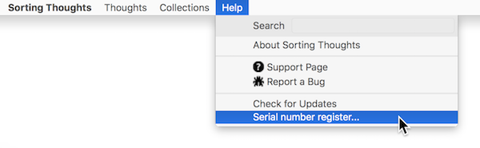

   [◀️ User Guide](benutzerhandbuch.md)

  [Home ▶️](index.md)

---------------
__Inhalt__
* TOC
{:toc}
---------------

## Frequently Asked Questions

#### I lost my registration code for ST desktop version.

Please contact me via the [contact form](https://www.sortingthoughts.de/blog/report-a-bug/).

---------------

#### I lost my password. What can I do now?

Sorry! You have no chance to read your data. Only yourself know the password. Please remember your desktop and mobile app password.

---------------

#### What is the different between single and family version?

The Family version can be used by up to 5 users and is also suitable for small businesses.

---------------

#### Which algorithm used Sorting Thoughts to encrypt my entries?

All entries in Sorting Thoughts are encrypted with the [XTEA](http://en.wikipedia.org/wiki/XTEA) (32 cycles) encryption algorithm. The encryption mechanism is a feature of the used database H2.

The iOS version used the [standard security features](https://images.apple.com/de/business/docs/iOS_Security_Guide.pdf) of iOS  with NSFileProtectionComplete to encrypt data.

---------------

#### I have found a bug or have questions.

If you found a bug or having a problem with Sorting Thoughts, please send me your bug report, question or problem by filling this contact form:
 [Report a bug](https://www.sortingthoughts.de/blog/report-a-bug/)

In the iOS app of ST you can send support mails directly.

---------------

#### Where can I enter the test registration code?

You can test all features of the desktop version except the sync service with a [30 day test registration code](https://www.sortingthoughts.de/blog/test-sorting-thoughts/). Please enter this code in the “Help > Serial number register...” dialog of the desktop version.

---------------

   [◀️ User Guide](benutzerhandbuch.md)

  [Home ▶️](index.md)

