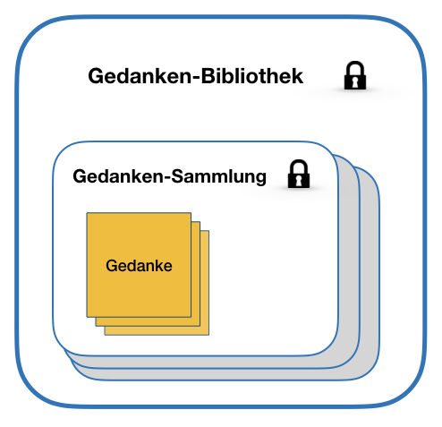
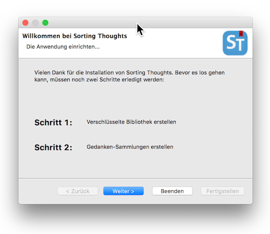
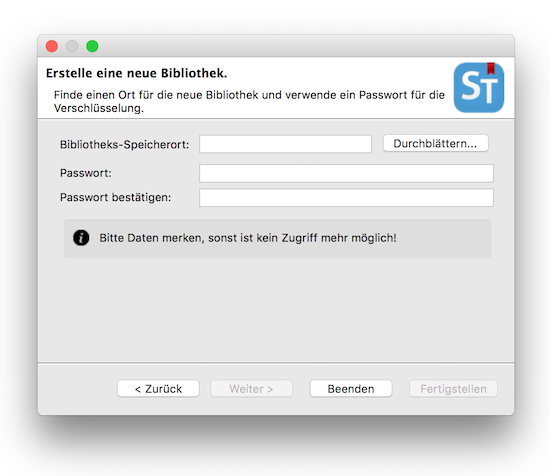
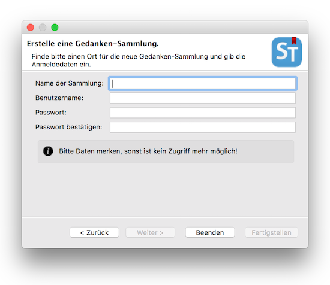
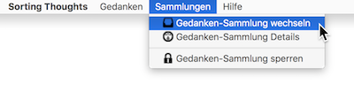
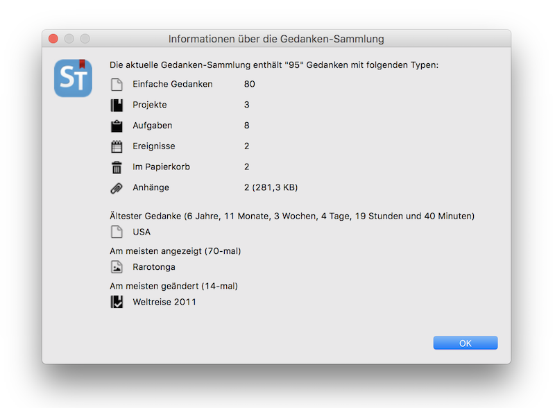
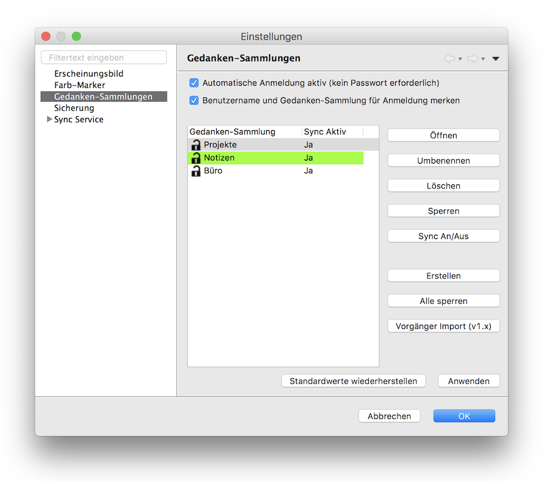
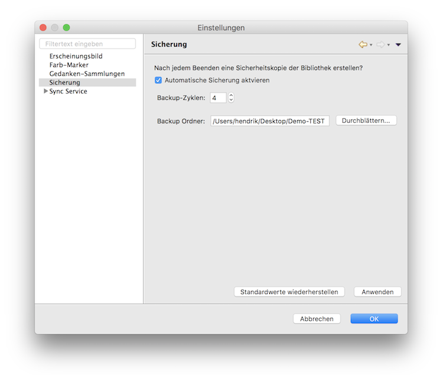

   [◀️ Installation](../installation.md)

  [Basics ▶️](grundlagen.md)

  

---------------
__Inhalt__
* TOC
{:toc}
---------------

## Thought library and collection

All thoughts that can be captured with Sorting Thoughts are stored in a thought collection. A collection of thoughts is in turn stored in a library of thoughts. Technically, a thought library is an encrypted database that can only be accessed if you have the correct credentials. In the mobile version of Sorting Thoughts for iOS, the thought library is automatically created and encrypted with the standard security features of the data security classes “Full Protection” of iOS, see also:  [iOS security (PDF)](https://images.apple.com/de/business/docs/iOS_Security_Guide.pdf)

### Create a thought collection

After starting the desktop version for the first time, you will be prompted to create a thought library and thought collection. To do this, you have to specify a directory where the thought library should be saved. You also have to give the thought collection a name and choose a username and password. The login data is very important, as this is the only way to gain access. If the login data is forgotten, nobody can access the data anymore.

-----

**ATTENTION:** 
Please remember your login data! There is no password reminder function - only you know the password!

-----

### Manage thought collections

Über den Menüpunkt **Sammlungen**:
Via the **Collections** menu item :

you can get more information about the current collection:

or change or lock the collection so that a password prompt is required the next time you open it.

In the settings for the thought collections, more collections can be created, collections deleted or locked. You can also activate the collection for the Sync Service here.

### Import old thought collections before version 2.0

In order to import thought collections prior to version 2.0 of Sorting Thoughts, the function **Legacy import (v1.x)** must be used in the settings for the thought collections. After selecting the *.h2.db file of the old collection and entering the user name and password, the import is carried out and the collection then appears in the collection list.

### Automatic login without password

Each collection of thoughts is password protected as described above. However, it is possible to open the Thought Collection without entering a password if you have not locked it. In this case, only the password of the thought library is requested at startup. If you do not want this password prompt either, you can activate automatic login in the settings for the thought collections. This is only recommended if you use the computer alone or if you do not save any thoughts that are worth protecting.

### Create automatic backups

The desktop version has an automatic backup function that packs and saves the entire thought library or database as a ZIP file after exiting. It can also be set how many backup files should remain until the next overwriting - a maximum of 10 backup cycles are possible.

---------------

   [◀️ Installation](../installation.md)

  [Basics ▶️](grundlagen.md)

