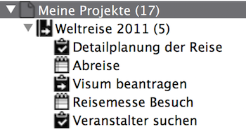
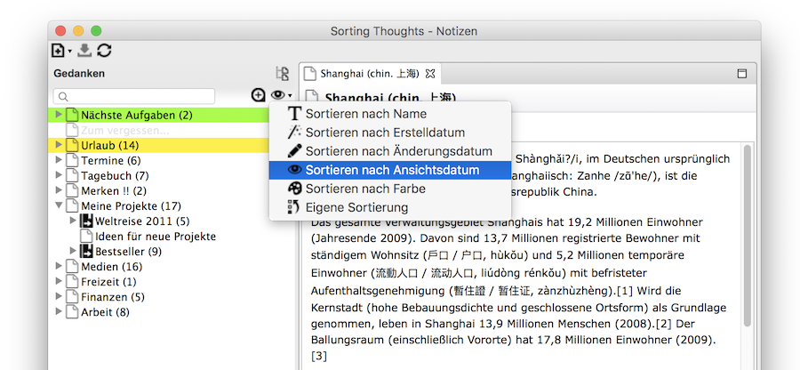
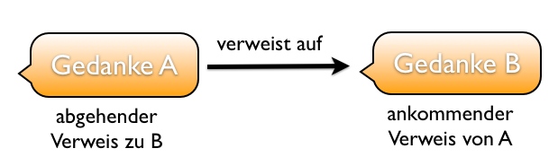
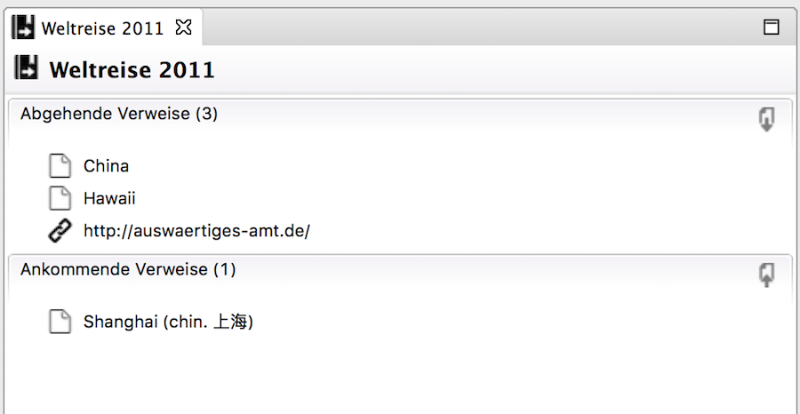
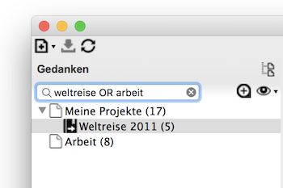
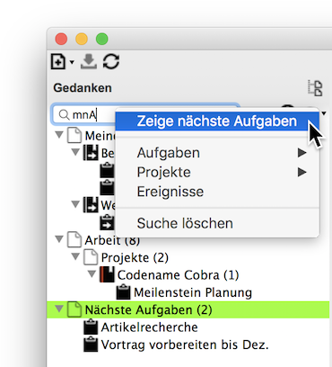
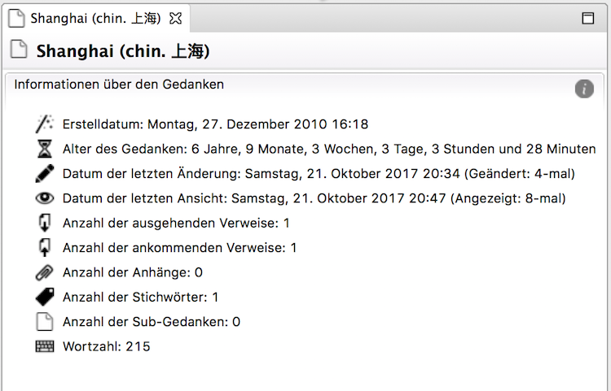
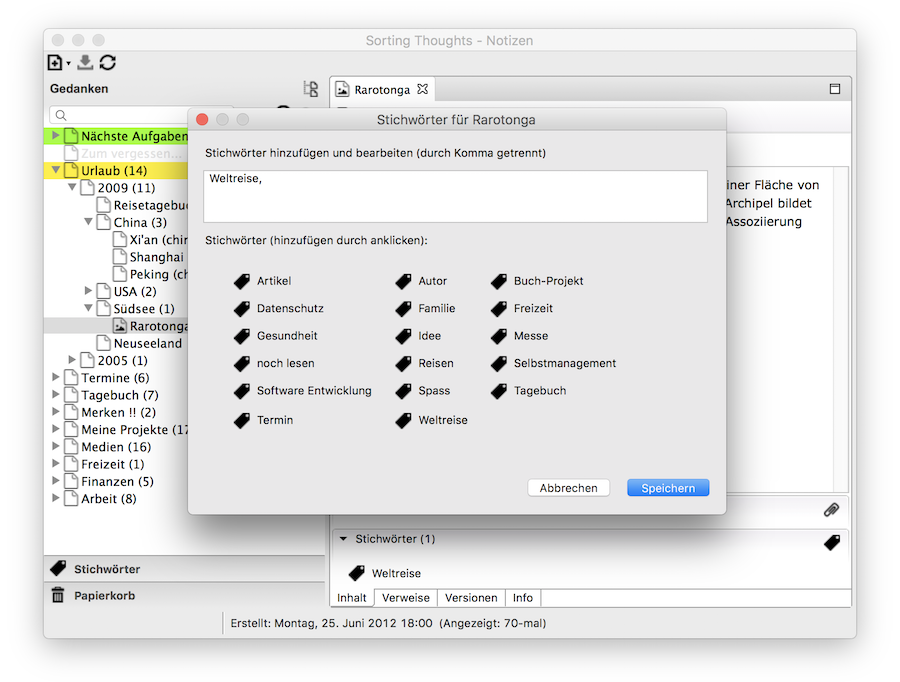
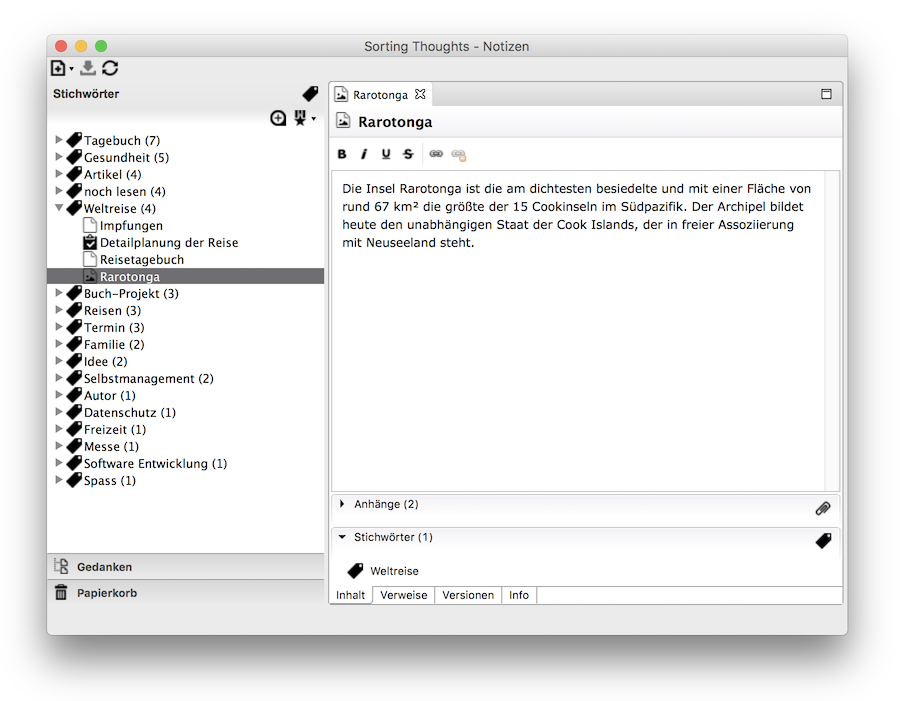

   [◀️ Basics](grundlagen_desktop.md)

  [Projects and Tasks ▶️](projekte_und_aufgaben.md)

---------------
__Inhalt__
* TOC
{:toc}
---------------

## Manage thoughts in the desktop version

### Structuring thoughts

The Sorting Thoughts thought tree allows you to store thoughts in a structured way. In this way it is possible to create sub-thoughts in order to create a relationship with the parent-thought. This is useful, for example, to assign tasks to a project, as shown in the following figure:

The thought tree is also very flexible and allows you to move thoughts freely, so that you can classify or rearrange them at any time. See also [Move a thought](https://sortingthoughts.github.io/st-documentation/handbuch/grundlagen_desktop.html#gedanke-verschieben).

### Sorting thoughts

The entries in the thought tree can be sorted according to the following criteria:

* By name (A to Z)
* By creation date (latest thought is at the top)
* By modification date (most recently modified thought is at the top)
* By view date (most recently viewed thought is at the top)
* By color
* Custom sorting (thoughts have a self-selected position)

The sorting order always applies to one level in the tree, i.e. sub-thoughts are sorted separately from the thoughts above them.

### Link thoughts

Thoughts can be linked to any other thoughts and website within the editor.

#### Create a link

**Internal links**

Links between thoughts can be easily created with a key combination. To do this, type the first letters of a thought into the editor and then press Ctrl + Spacebar or under Mac OS X Control + Spacebar and select the thought for the reference. A link can also be created via the link dialog.

**External links**

To refer to a website, it is sufficient to enter the respective URL in the editor. If a different link name is to be used, the link can also be created via the link dialog.

#### Follow a link

Each link can be accessed by holding down the Ctrl key or the Command key (macOS) and then clicking on it.

#### Incoming and outgoing referrals

There are two different perspectives on references. The figure below illustrates this. Thought A refers to B. The reference is outgoing from Thought A's perspective and incoming from B's perspective.

All incoming and outgoing references of a thought are summarized on the **Links** tab. Links can be called up there by double-clicking.

### Search and filter

#### Text search

The search input above the thought tree allows you to find thoughts quickly. Simply type in the search term and press the enter key. All search hits are then visible in the thought tree. The search takes into account both the thought name and the content of the thought. By deleting the search word in the search entry, all thoughts become visible again. The search can be made very flexible by using the following search options:

| Search option | Description | Example |
|:--------|:-------:|:-------:|
| Wildcards | To specify a wildcard for a single character, use "?". To specify a wildcard for multiple characters, use "*".    Note: Both wildcards can be used within or at the end of the search term, but not at the beginning. | **te?t**  would search for all words like "test" or "text".   **test***  would search for all words like "test" or "tester". |
| Word groups | Word groups can be searched by enclosing them in quotation marks. | **"test text"**   searches only for entries that contain the words "test" and "text" as a group. |
| Logical operators | Logical operators can be used with the AND and OR operators. The OR operator is used by default, so it does not need to be explicitly written.    It is also possible to exclude search terms using the NOT operator. | **test AND text**   searches for all entries that contain both the word "test" and "text".    **test OR text** or **test text**   searches for all entries that contain "test" or "text".    **test NOT text**   searches only for entries that contain "test", but not the word "text". |
| Fields | To search only in thought names, you can prefix the search term with "THOUGHT_TITLE:". | **THOUGHT_TITLE:test**   searches only for entries that contain the word "test" in the name. |

#### Filter

In addition to the search, there are also filter functions with which it is possible to get a quick overview of certain thought types. The filters can be accessed by right-clicking on the search input field. As the following screenshot shows, the following filters are available:

| Filter | Search term for quick access * |
|:--------|:-------:|
| Next tasks - shows all due tasks, sorted by priority and end date | mnT |
| Tasks (Office, Private, Other, All) | moT, mpT, mmT, mT |
| Projects (Office, Private, Other, All) | moP, mpP, mmP, mP |
| Events | mE |

\*) the search term **mnT** stands, for example, for “**m**y **n**ext **t**asks ” and **moP** for “**m**y **o**ffice **p**rojects ”

As with search, parent thoughts are part of the result set to preserve thought context.

### Metadata

Every thought has something called metadata that provides more information about the thought. For example, the **Info** tab shows how old a thought is, when it was last changed, or how many words it contains. Projects and tasks also have additional metadata, which include information about status changes - see also Special Thoughts.

Metadata:
* Creation date
* Age of the thought
* Date of last modification
* Date of last view
* Date of last synchronization
* Number of incoming and outgoing references
* Number of tags
* Number of sub-thoughts
* Word count

### Tags

#### Assign tags

If the rigid hierarchical tree structure for thoughts is not sufficient to organize thoughts, it is also possible to add tags to thoughts. Any number of thoughts can be assigned to a tag and a thought can also have any number of tag. In order to provide a thought with tags, the **Tags** dialog must be opened from the area of ​​the same name. There you can freely define tags or select existing tags. Multiple tags are simply separated by a comma.

By the way, if a tag is no longer used, it disappears from the tag list.

#### Navigation by tag

All tags are listed in an extra tag view and can be sorted there by use and name. It is possible to get a quick overview of all tags and to open thoughts from this view. You can also jump directly to the tag view from the tag area below a thought. Simply double-click on the respective tag. So you can quickly see all other thoughts that also have this tag.

#### Use tags for projects and tasks

Stichwörter sind besonders nützlich für Projekte und Aufgaben, da so weitere Ordnungskriterien sehr leicht hinzugefügt und gepflegt werden können. Ein Projekt oder eine Aufgabe kann z.B. an einem bestimmten Ort oder für einen bestimmten Kunden oder zu einer bestimmten Zeit stattfinden. Folgenden Stichwörtern können so beispielsweise für mehr Übersicht sorgen:

Tags are particularly useful for projects and tasks, as they make it very easy to add and maintain further classification criteria. For example, a project or task may take place at a specific location, for a specific client, or at a specific time. The following keywords, for example, can provide a better overview:

| Sorting criterion | Tag examples |
|:--------|:-------:|
| Location |  @Berlin, @Dubai |
| Person | customerMiller, Max Miller|
| Time | 0-Daily, 1-Now, 2-Next, 3-Soon, 4-Later, 5-Someday, 6-Postponed|
| What | Active project, Inactive project, Idea, Research project|
| Evaluation | Successful project, Disaster project|
| Context | Product name, Technology name, Superordinate project, Budget |

---------------

   [◀️ Basics](grundlagen_desktop.md)

  [Projects and Tasks ▶️](projekte_und_aufgaben.md)

