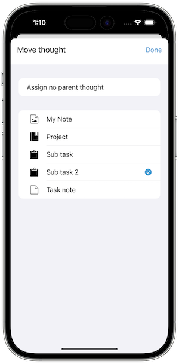

   [◀️ Basics](grundlagen_mobile.md)

  [Projects and Tasks ▶️](projekte_und_aufgaben.md)

---------------
__Inhalt__
* TOC
{:toc}
---------------

## Manage thoughts with the mobile version

### Structuring thoughts

The thought context menu allows you to structure your thoughts. Use the **Add sub thought** function to create a sub thought. The sub thought will be displayed as a child thought of the selected thought. The following screenshot shows the thought context menu:

The number of children of a thought is displayed in the thought list. The following screenshot shows the thought list with multiple sub thought:

You can also move a thought to another parent thought. To do this, open the thought context menu of the thought you want to move and then select the **Move thought** function. The following screenshot shows the move thought view:

### Sorting thoughts

To sort the thought list, tap on the following icon:

You can sort the thought list by the following criteria:

* title
* creation data
* modification date
* view date
* color

The following screenshot shows the sort criteria view:

### Filter thoughts

The thought list can also be filtered, simply tap on the following icon:

If a filter is active, the filter icon is highlighted.

You can filter the thought list by the following criteria:

* all thoughts (default)
* projects
* tasks
* next tasks (displays all uncompleted tasks, urgent ones first)
* events

Sub thoughts are also displayed in the filtered view. The following screenshot shows the filter criteria view:

### Information about a thought

The context menu of a thought contains the **Information** function. This function displays the following information about the thought:

### Tags

Every thought can be assigned any number of tags to make it easier to find. Tags can be assigned to a thought via the context menu and **Tags**. New tags can be assigned via the upper input field and the plus symbol. Existing tags can be removed by tapping on the tag. The following screenshot shows the edit tag view:

Existing tags of the thought collection are listed in the tag view and can be easily selected. The thought list shows all tags and their linked thoughts:

It is also possible to sort the tag list by the following criteria:

* name
* usage resp. the number of linked thoughts

The following screenshot shows the sort criteria view:

---------------

   [◀️ Basics](grundlagen_mobile.md)

  [Projects and Tasks ▶️](projekte_und_aufgaben.md)

