

   [◀️ Thought library](gedanken_bibliothek.md)

  [Manage thoughts ▶️](gedanken_verwalten_desktop.md)

---------------
__Inhalt__
* TOC
{:toc}
---------------

## Basics desktop version

The figure below shows the main elements of Sorting Thoughts:

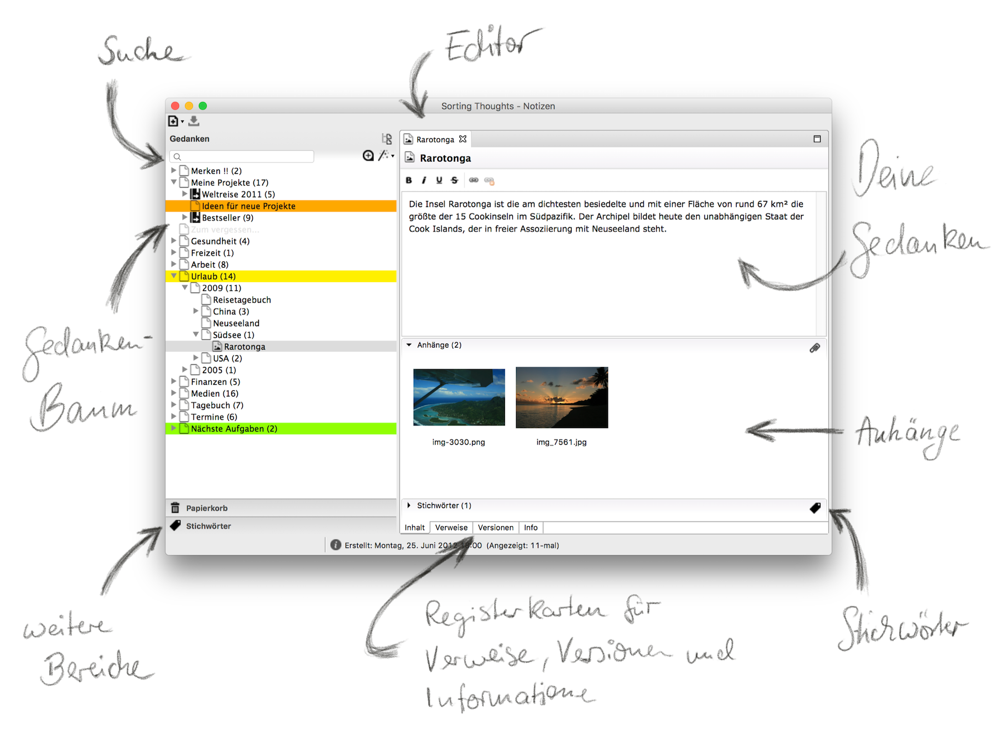

### Create a thought

A thought can be created from the menu or by pressing Ctrl+N or Command+N on macOS.

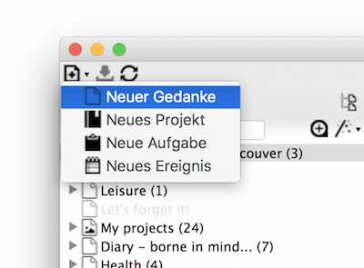

The following thought types can be created (see Special Thoughts):
- simple thought
- project thought
- task thought
- event thought

Sub-thoughts can be created via the context menu (right-click) of a thought, which are then sorted below the selected parent-thought.

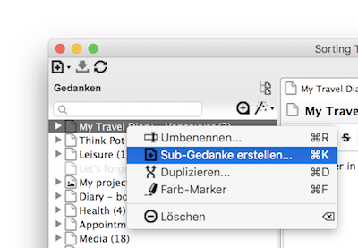

### Edit a thought

The content of a thought is edited in the editor. The editor has the following functions for formatting the text:

- Bold
- Italic
- Underline
- Strikethrough

In addition, references can be created within the thought text. See [Linking thoughts](https://sortingthoughts.github.io/st-documentation/handbuch/gedanken_verwalten.html#verlinken)

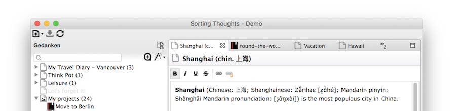

There are advanced editors for projects, tasks and events. You allow the collection of further data. The following figure shows a project editor:

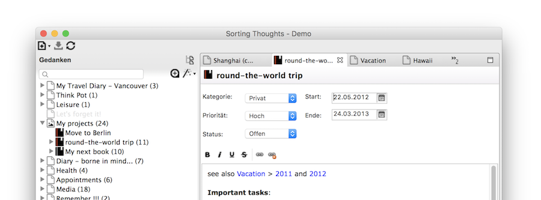

### Print a thought

Thoughts can be printed out via the print dialog available in the menu or in the context menu of the editor. See also [keyboard shortcuts](https://sortingthoughts.github.io/st-documentation/handbuch/grundlagen_desktop.html#tastaturbelegungen).

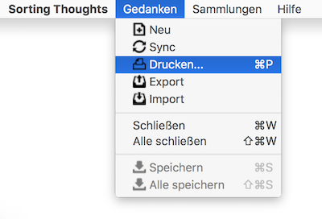

### Duplicate a thought

Thoughts can be duplicated via the context menu (right click on the thought). If the thought has other sub-thoughts, you can choose whether these should also be duplicated. Attachments can also be duplicated if desired.

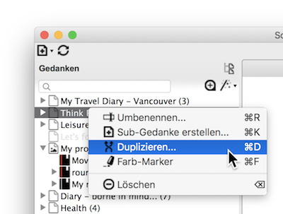

### Delete a thought

To delete thoughts, simply select **Delete** in the context menu (right click on the thought). If the thought has other sub-thoughts, it is possible to delete them as well.

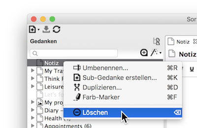

After confirming the deletion, the thought is moved to the recycle bin. Thoughts in the recycle bin can be restored at any time as long as the recycle bin has not been emptied.

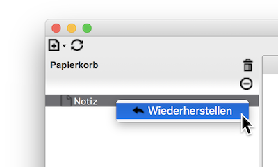

### Mark a thought with a color

So that thoughts can be found more quickly in the navigation tree, it is possible to color-mark thoughts. To do this, simply right-click on a thought to open the color marker dialog and select a color.

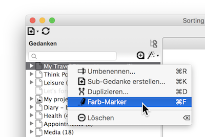

The individual color names can be changed in the program settings, as shown in the next figure:

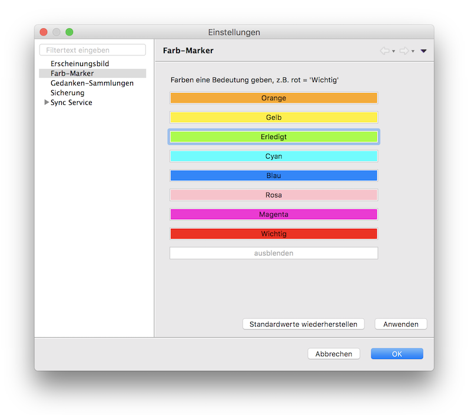

### Rename a thought

The name of a thought can be changed via the context menu item Rename (right click on a thought). It is possible to assign names more than once.

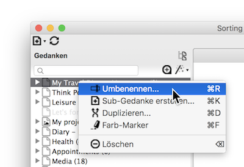

### Move a thought

Thoughts can be easily moved around the navigation tree using drag and drop.

### Attach files

Any file can be attached to any thought. The files are also stored in the thought collection (database). The easiest way to attach files is to drag and drop the relevant files onto the thought.

The "Attachments" section under the thought editor has a context menu (right-click) with additional functions:

| Menu Item | Function |
|:--------|:-------:|
| Open | Opens the file with the default program defined in the operating system. |
| Export | Exports the file to a directory. |
| Details | Opens a dialog with additional information about the file. |
| Delete | Permanently deletes the file. |
| Zoom In / Zoom Out | Enlarges or reduces the thumbnail representation of the files. |
| Check for Changes | Checks if opened attachments have been changed and allows updating the attachments. |

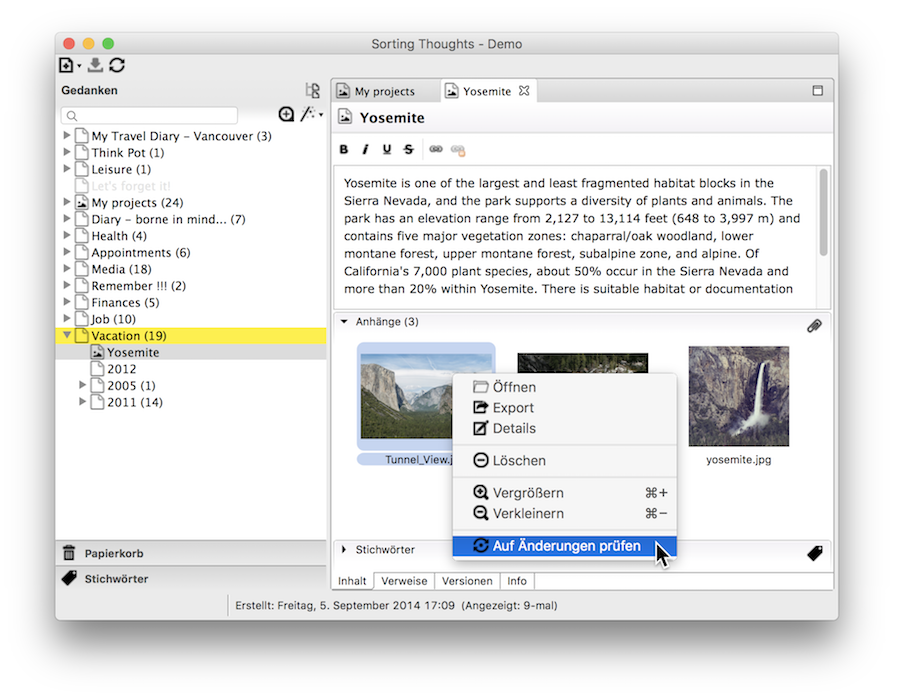

### Keyboard shortcuts

| Function | Windows | macOS |
|:--------|:-------:|:-------:|
|Close all thoughts | Shift + Ctrl + W | Shift + Command + W |
|Save all thoughts | Shift + Ctrl + S | Shift + Command + S |
|Settings |Ctrl + , | Command + , |
|Print thought |Ctrl + P | Command + P |
|Duplicate thought | Ctrl + D | Command + D |
|Mark thought with color | Ctrl + F | Command + F |
|Close thought | Ctrl + W | Command + W |
|Save thought |Ctrl + S | Command + S |
|Rename thought |Ctrl + R | Command + R |
|New thought |Ctrl + N | Command + N |
|Select active thought in tree |Ctrl + L | Command + L |
|Add tag |Ctrl + T | Command + T |
|Show keyboard shortcuts | Shift + Ctrl + L | Shift + Command  + L |
|Create sub-thought |Ctrl + K | Command + K |
|Open reference |Ctrl + left mouse button | Command + left mouse button |
|Fullscreen (On / Off) | Shift + Ctrl + F | Shift + Command  + F |

---------------

   [◀️ Thought library](gedanken_bibliothek.md)

  [Manage thoughts ▶️](gedanken_verwalten_desktop.md)

