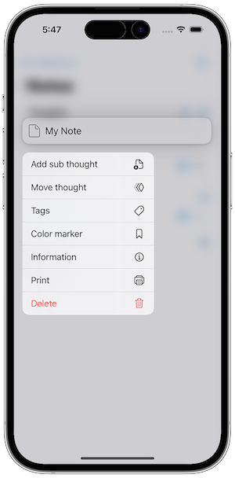
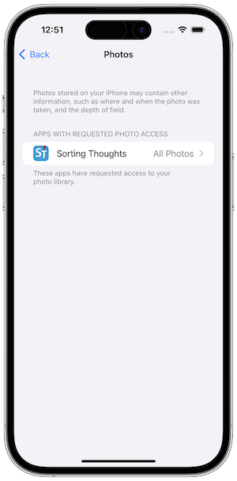

   [◀️ Thought library](gedanken_bibliothek.md)

  [Manage thoughts ▶️](gedanken_verwalten_mobile.md)

---------------
__Inhalt__
* TOC
{:toc}
---------------

## Basics Mobile-Version

The following three screenshot shows the main elements of Sorting Thoughts for iOS. 

The first screenshot shows the home screen. Here you can create a new thought collection or open an existing one. Besides this you can also open the sync, settings, in-app store or the help page.

The second screenshot shows the content of a thought collection. Here you can create new thoughts or open existing ones. You can also search for thoughts or filter them.

The third screenshot shows the content of a thought. Here you can edit the thought. You can also add attachments or view older versions of the thought.

Here, for simplicity's sake, the iPhone® version is shown. In the iPad® version, some elements are placed differently, but otherwise the iPad® version behaves the same way.

---------------

**Hint:** To use all functions described here, you need at least the **Max Pack** or a **Sync Service Subscription**.

---------------

### Create a thought

To create a new thought use the following button on the thought list view:

You can create four different types of thoughts, just like in the desktop version:

* standard thought
* project
* task
* event

You can easily switch between the different types of thoughts by using the tabs at the top of the screen.

### Edit a thought

Thoughts have a view and edit mode. To switch to edit mode, simply press the thought content or press the edit button. In edit mode, the thought can be edited. Special types of thoughts have additional fields that can be edited. To exit edit mode, simply press the done button. 

In the thought list view you can reach more editing functions by using a force touch gesture on the thought. This will open a context menu with the following functions:

### Print a thought or send it by email

The thought context menu also contains the print and share function. The print function prints the thought. The share function opens the iOS share dialog and allows you to send the thought by email or to other apps.

### Delete a thought

The thought context menu also contains the delete function. This will move the thought to the trash. The trash can be emptied by using the trash icon in the thought list view. Every thought in the trash can be restored by using the restore function in the thought view

### Mark a thought with a color

A thought can be marked with a color by the thought context menu. This will highlight the thought in the thought list. Just like in the desktop version, the color names can be changed. To do this, simply force touch the color line and change the name.

### Attach files to a thought

It is possible to attach photos to a thought. To do this, press the **Attachments** button and then select an existing photo from the gallery via the plus symbol. A description of the attachment can be assigned via long press.

It is important that Sorting Thoughts has permission to read photos from the gallery. If you have denied permission, no photos can be selected. To grant permission retroactively, you must grant the right to Sorting Thoughts in the iOS settings under Privacy:

---------------

   [◀️ Thought library](gedanken_bibliothek.md)

  [Manage thoughts ▶️](gedanken_verwalten_mobile.md)

