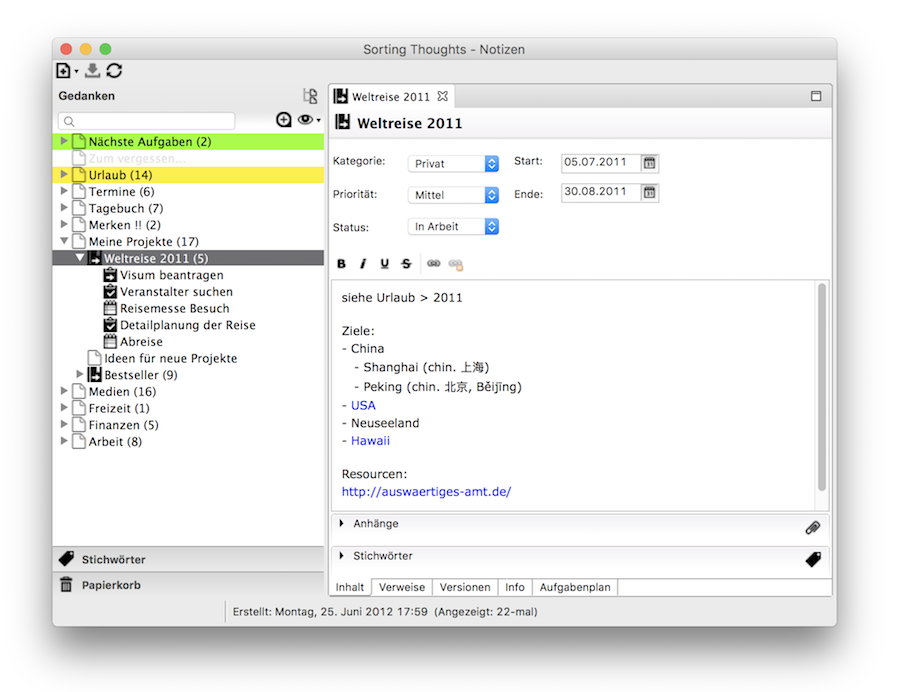
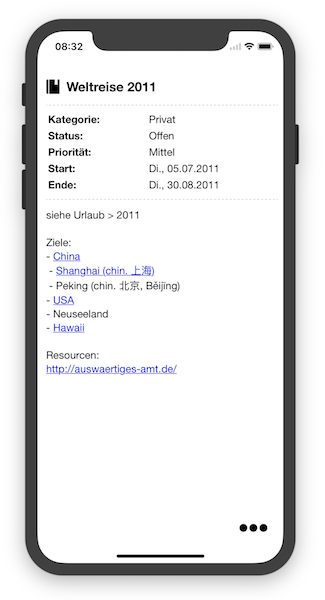
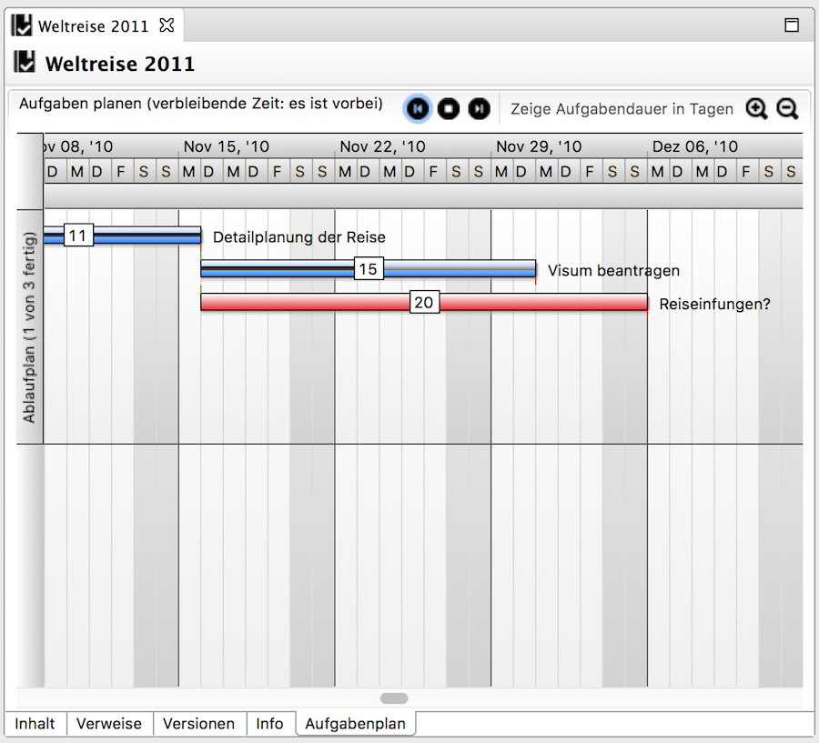
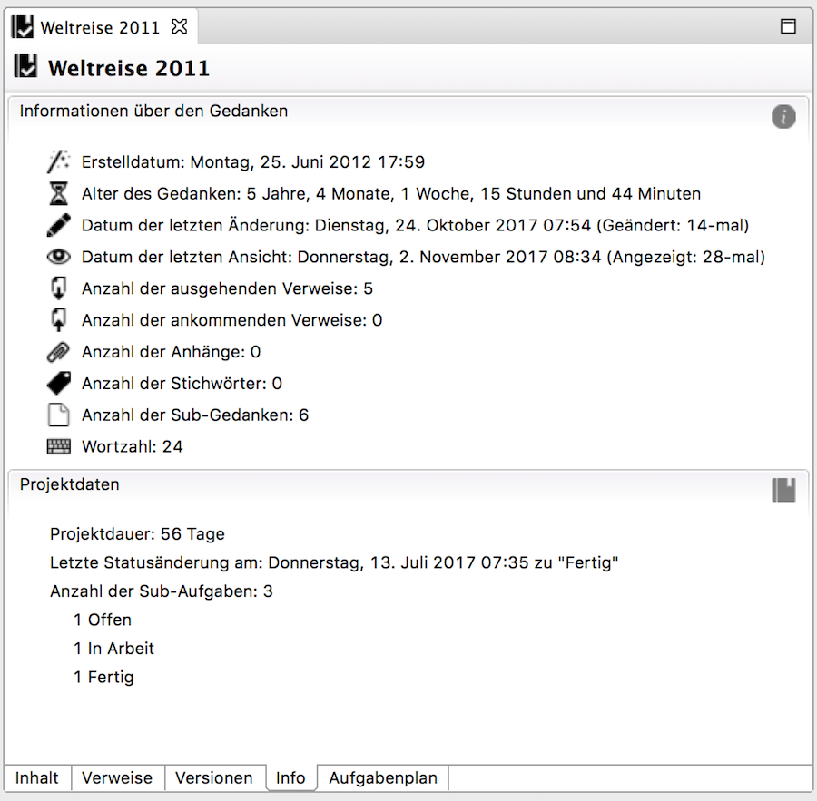
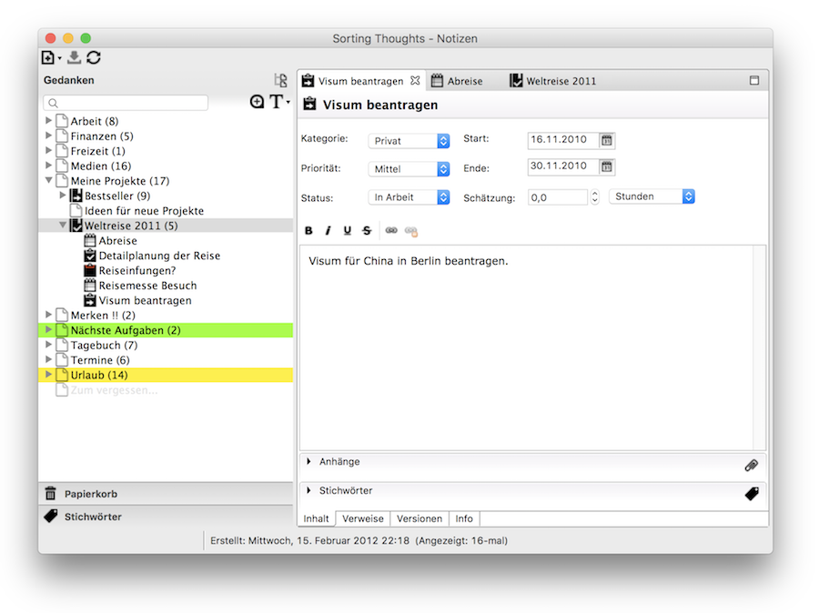
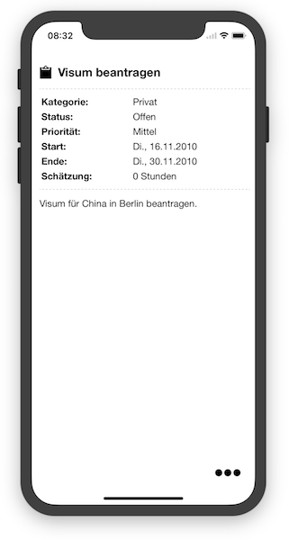
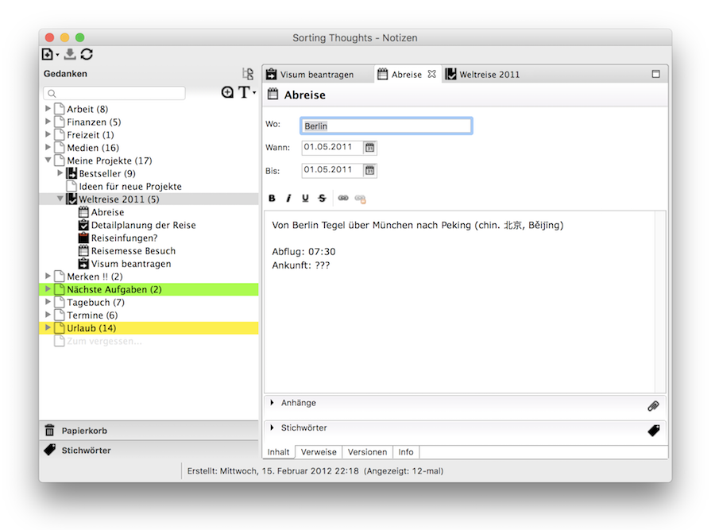
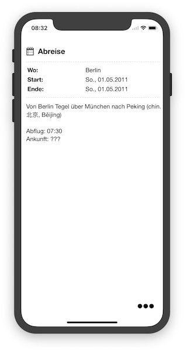

   [◀️ Manage thoughts](gedanken_verwalten.md)

  [Sync Service ▶️](../sync_service.md)

---------------
__Inhalt__
* TOC
{:toc}
---------------

## Project and task management

In addition to simple thoughts, it is also possible to create and manage projects, tasks and events with Sorting Thoughts. These special thoughts have additional input fields and metadata.

### Projects

Each project thought in the desktop version has a **Task Schedule** view that visualizes all sub-tasks of the project in a Gantt chart. It is also possible to plan tasks in the Gantt chart by shifting them in time. You can open the tasks directly by double-clicking on a task bar.

The metadata of a project thought has an extra section that provides information about how long the project was in what status and how many subtasks the project has.

### Tasks

### Events

### Additional search filters

There are additional search filters in Sorting Thoughts that make it easier to find tasks and projects. For example, the next due tasks can be displayed or all projects from the **Office** category .

The following filters can be reached by right-clicking on the search input field:

See also [Search and Filter](./gedanken_verwalten_desktop.html#filter)

---------------

   [◀️ Manage thoughts](gedanken_verwalten.md)

  [Sync Service ▶️](../sync_service.md)

