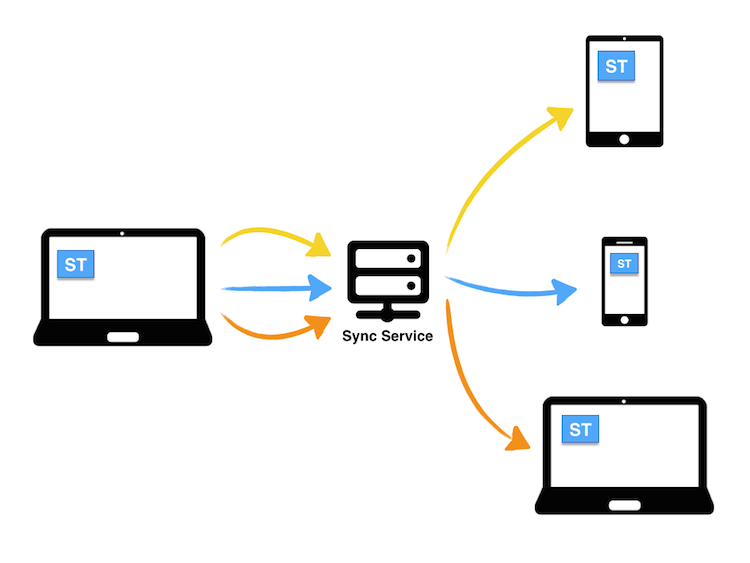
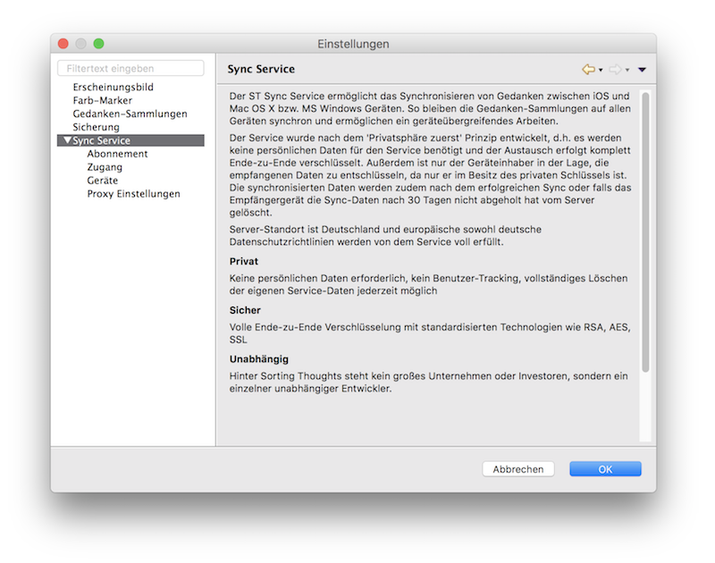
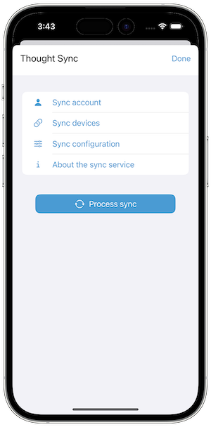

   [◀️ Projects and Tasks](./handbuch/projekte_und_aufgaben.md)

  [FAQ ▶️](fragen_und_antworten.md)

---------------
__Inhalt__
* TOC
{:toc}
---------------

## Sync Service

The ST Sync Service allows you to synchronize thoughts between iOS and macOS or MS Windows devices. This keeps the thought collections synchronized on all devices and allows cross-device work.

The service is implemented according to the 'privacy first' principle, i.e. no personal data is required for the service and the exchange is completely end-to-end encrypted. In addition, only the device owner is able to decrypt the received data, because only he is in possession of the private key. The synchronized data is also deleted from the server after successful synchronization or if the receiving device has not picked up the synchronization data after 30 days.

Server location is Germany and European as well as German data protection guidelines are fully met by the service.

**Private**

No personal data required, no user tracking, complete deletion of your own service data possible at any time. It is only a sync service and does not contain any cloud backup - you have alawys the full control over your data.

**Secure**

The sync service supports full end-to-end encryption with standardized technologies such as RSA, AES, TLS/SSL. The data is encrypted on the sending device and can only be decrypted on the receiving device. The service provider has no access to the data.

**Independent**

Behind Sorting Thoughts is not a big company or investors, but a single independent developer. The developer used Sorting Thoughts himself for many years and developed it further. The sync service is also operated by the developer himself and is not outsourced to a third party.

### Setup the sync service

#### 1. Step: Create an account

To use the sync service, you first need a sync service account. The account can be created with a username and password in the mobile as well as in the desktop version.

**Sync-Service settings of the desktop version**

**Sync-Service settings of the mobilen version**

#### 2. Step: Choose a sync service subscription

To use the sync service, you need a sync service subscription. The subscription is linked to the sync service account when it is created. The following subscriptions are available:

| Subcription | Features | Price (depends on your Country)  |
|:------|:------:|:------:|
| 1-Month-Subscription | Sync Service and all features of the Sorting Thoughts mobile app for **1 month**. This subscription is ideal for trying out all sync features. | 1.99 EUR (Europe)|
| 1-Year-Subcription | Sync Service and all features of the Sorting Thoughts mobile app for **1 year**. | 14.99 EUR (Europe) |

If you buy an auto renewing subscription over the iOS App Store you can try the sync service for 1 week for free. Customers who have already purchased the Sorting Thoughts desktop version and have an active sync service subscription can use all features of the iOS app for free.

You can subscribe to the sync service directly from the iOS version of Sorting Thoughts or by purchasing a registration code on the [Sorting Thoughts homepage](https://www.sortingthoughts.de/blog/en/buy-sorting-thoughts/).

#### 3. Step: Add more devices to the sync service

The sync service only makes sense if you use Sorting Thoughts on multiple devices. After step one and two, further devices should now be linked to the sync service.

To do this, the sync service must be activated in the settings of the desktop version and/or the mobile version. The sync service is activated by entering the username and password of the sync service account.

Technically, with each connection, a private and public key is created that is needed to encrypt the data to be synchronized. The private key is stored on the device and does not leave it, i.e. only the device that has the private key can decrypt the received sync data. The public key is sent to the sync service so that other devices can encrypt sync data for the device - this is called end-to-end encryption (E2EE).

#### 4. Step: Configure the sync 

Now you can configure which thought collections should be synchronized with which devices. This is done in the settings of each installation. On the desktop version the settings will be displayed before you start the sync. On the mobile version you can configure the sync in the settings of the sync service.

To synchronize a thought collection, the sync must be activated in the sync settings and you must choose the devices which should be synchronized with this thought collection.

### Process the sync

After the sync has been configured, the sync can be started. The sync must be always started manually and will not processed in the background. You must also wait until the sync is finished. 

If you have configured the sync on multiple devices, you should always start the sync on the device where you have made the most changes. This ensures that the sync is processed as quickly as possible.

If the sync for a thought collection is deactivated and this thought collection is later reactivated, it must be noted that all contents of the collection must be transferred again. Only if the sync remains active, only the changes will be transferred.

### Important information

**Delete account**

It is possible to delete your access at any time, but please note that the information about the subscription can be also deleted and the subscription will be terminated prematurely. **This will happen if you delete your access on all devices and you have an non-renewing subscription.** 

**Support ID**

For support requests regarding the sync service, please also provide the personal support ID (to be found under Settings / Sync Service / Access on the desktop version). The mobile app users should use the internal support function to send the support ID. Without the support ID, it is not possible to identify the associated user account in the sync service.

**Data volumn of the sync data**

The sync data is encrypted and therefore cannot be compressed. In addition, the sync data is encrypted separately for each device (because usage of end-to-end encryption), so that the sync data for each device must be transferred separately. For example, if a sync is sent to three devices, the amount of data to be transferred is tripled.

---------------

   [◀️ Projects / Tasks](./handbuch/projekte_und_aufgaben.md)

  [FAQ ▶️](fragen_und_antworten.md)

